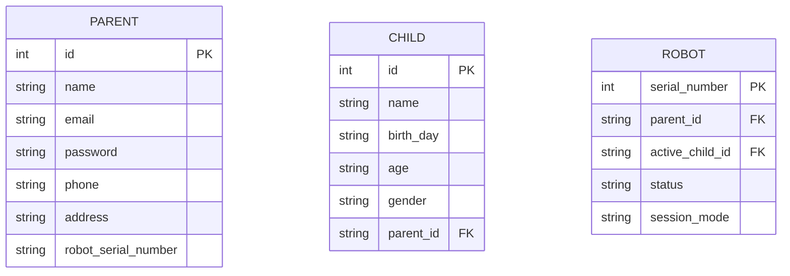
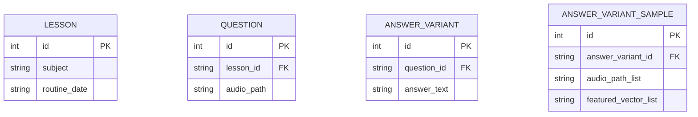
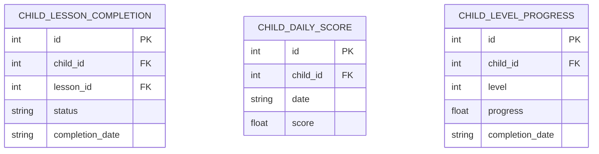
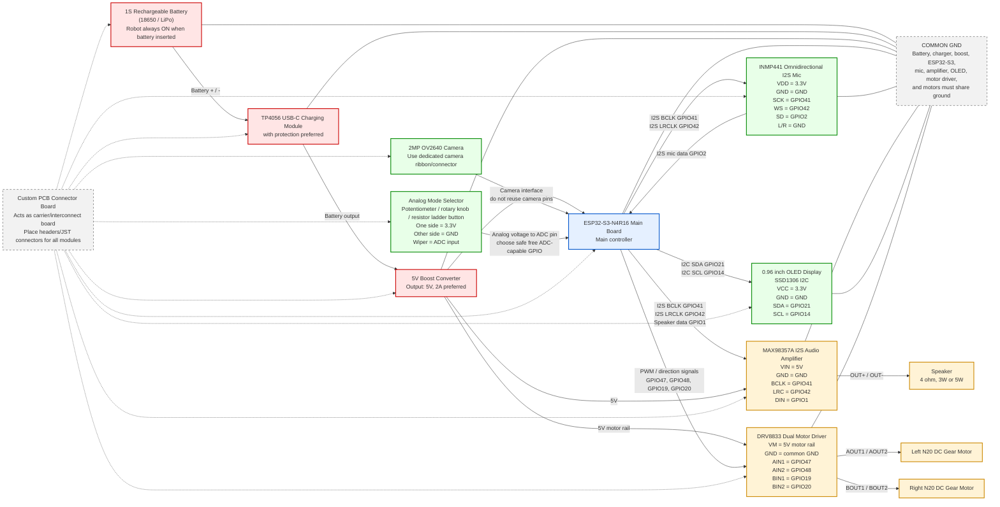

# Prorject: TokiPanda
## Technical Objective
A robot is built for teaching kids some learning materials through a series of interactive sessions. It includes an audio interface for interacting with the robot. 
### Audio streaming and learning sessions
When the robot is turned on and connects to wifi, it sends an HTTP request to the server to start the learning session. The server responds with a "OK" status, sample response:
```bash
HTTP/1.1 200 OK
Content-Type: application/json
{
    "status": "ok",
    "message": ""
}
```
Then sever sends greetings audio to the robot. Robot plays the audio and waits for the kid to respond. When the learning session starts, server sends an audio containing questions for the kid to answer. Sample incoming question audio:
```bash
HTTP/1.1 200 OK
Content-Type: application/json
{
    "status": "question",
    "message": "
        "audio": "sample.wav",
        "waiting_period": "15"
    "
}
```
Robot plays the audio and waits necessary time (waiting_period) for the kid to respond. After playing the audio, robot activates microphone and collects audio data from the kid. The collected audio is sent back to the server. server responds with "OK" to the robot's request after the audio is sent back.
Sample response \#1:
```bash
HTTP/1.1 200 OK
Content-Type: application/json
{
    "status": "next_question",
    "message": "
        "audio1": "congratulations.wav",
        "audio2": "next_question.wav",
        "waiting_period": "15"
    "
}
```
Sample response \#2:
```bash
HTTP/1.1 200 OK
Content-Type: application/json
{
    "status": "question_repeat",
    "message": "
        "audio1": "saying_wrong_answer.wav",
        "audio2": "question.wav",
        "waiting_period": "15"
    "
}
```
Sample response \#3:
```bash
HTTP/1.1 200 OK
Content-Type: application/json
{
    "status": "next_question_with_previous_answer",
    "message": "
        "audio1": "right_answer.wav",
        "audio2": "next_question.wav",
        "waiting_period": "15"
    "
}
```
### Video feed processing for robot's movement with kids
Video feed is streamed to the server for real-time monitoring. When the robot is turned on, camera feed is enabled and streams video to the server using wifi. Server always responds to the robot's requests as "OK" unless the kid away from the center. Sample response is:
```bash
HTTP/1.1 200 OK
Content-Type: application/json
{
    "status": "ok",
    "message": ""
}
```
When the kid is away, sample server response is:
```bash
HTTP/1.1 200 OK
Content-Type: application/json{
    "status": "move",
    "message": "
        "right":"0.1cm",
        "left":"0.1cm",
        "forward":"0.1cm",
        "backward":"0.0cm",
    "
}
```
Inside robot, esp32s3-N4R16 sends signal to esp32c3-devkit via esp-now. esp32c3-devkit receives the signal and moves the robot accordingly by calculating the distance, motor speed and direction to move.  
## Server design
### Audio processing techniques
An util function `audio_processing` is used to process the audio files and generate the audio responses for the robot. The server compares featured vector of incoming .wav file with the featured vectors of probable answers and scores the percentage similarity. If the similarity score is above a threshold, the server responds with the corresponding audio file. For generating featured vectors of audio files, we used MFCC+DTW algorithom.
Visual representation of audio processing:

### Database models
Parent and Robot models:

Lessons --> Question --> Answer model:

Child's lesson completion model:

now new schematic:
