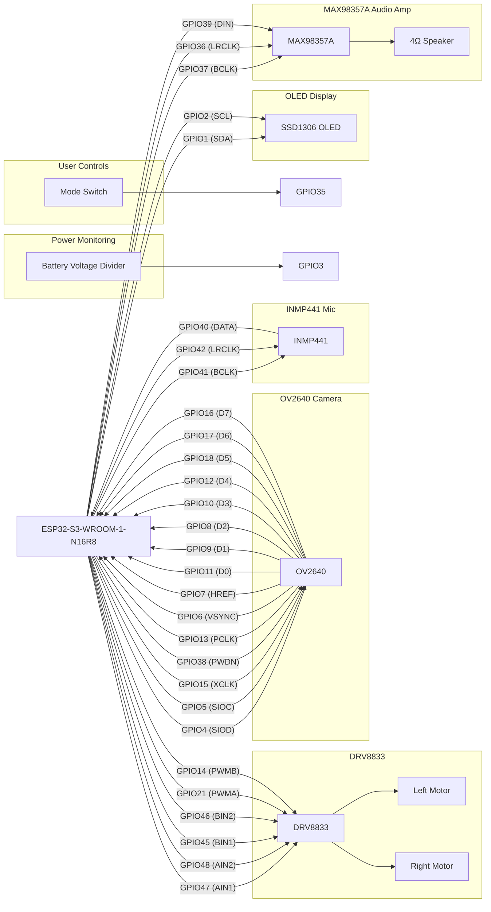
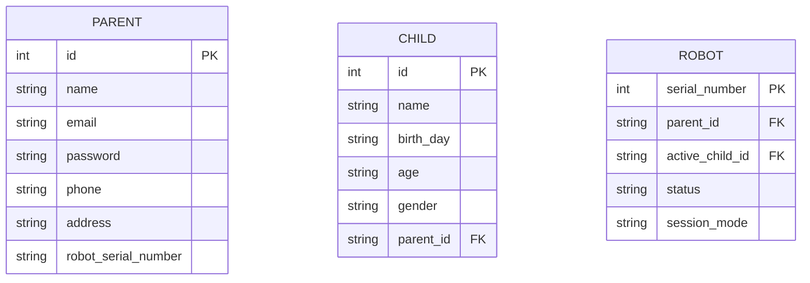
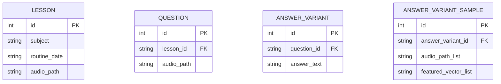
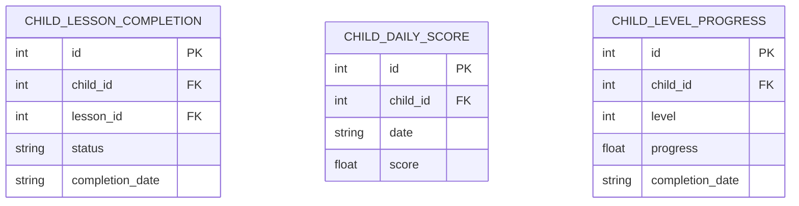

# Project: TokiPanda

## Project Overview

TokiPanda is a Wi-Fi connected educational robot designed for children.

The robot acts primarily as a thin client. Most decision making, lesson management, speech evaluation, child tracking, and movement planning are performed by a central server.

The robot is responsible for:

* Playing lesson audio
* Recording child responses
* Capturing camera images
* Displaying emoji feedback
* Moving according to server commands
* Maintaining communication with the cloud platform

The robot is not expected to perform local AI processing.

---

## System Objectives

The system must support:

1. Interactive audio-based learning sessions
2. Child response recording through microphone
3. Server-side answer evaluation
4. Emoji feedback display
5. Parent monitoring through camera feed
6. Child-following movement
7. Wi-Fi connectivity
8. Battery-powered operation

---

## Typical Learning Session

### Startup

1. Battery is inserted.
2. Robot powers on automatically.
3. ESP32-S3 connects to configured Wi-Fi.
4. Robot authenticates with backend server.
5. Server assigns active lesson.

### Lesson Playback

1. Server sends greeting audio.
2. Robot plays greeting audio.
3. Server sends lesson audio.
4. Robot plays lesson audio.

### Question and Answer

1. Server sends question audio.
2. Robot plays question audio.
3. Speaker is muted.
4. Microphone records child response.
5. Audio is uploaded to server.
6. Server evaluates response.
7. Server returns:

   * Correct answer feedback
   * Wrong answer feedback
   * Next question
   * Repeat request

### Emoji Feedback

OLED display shows:

* Happy emoji for correct answers
* Neutral emoji while listening
* Sad emoji for incorrect answers
* Sleeping emoji during standby

### Child Tracking

Camera images are continuously sent to the server.

Server determines:

* Child presence
* Child position
* Distance from robot

When child moves outside acceptable range:

1. Lesson playback pauses.
2. Server calculates movement.
3. Movement commands are sent to robot.
4. Robot repositions itself.
5. Lesson resumes.

---

## Daily Session Completion

When daily lesson quota is reached:

1. Server marks session complete.
2. Robot enters low-power standby mode.
3. Robot periodically checks server for wake requests.
4. Parent may reactivate robot through mobile application.

---

## Hardware Platform

### Main Controller

ESP32-S3-WROOM-1-N16R8

Features:

* Dual-core processor
* Wi-Fi connectivity
* 16 MB Flash
* 8 MB PSRAM
* Camera support
* I2S audio support

---

## Hardware Components

### Audio Input

Component:

* INMP441 Digital I2S Microphone

Purpose:

* Capture child speech
* Stream audio to backend server

---

### Audio Output

Components:

* MAX98357A I2S Amplifier
* 4Ω 3W Speaker

Purpose:

* Play lesson audio
* Play greetings
* Play feedback audio

---

### Camera

Component:

* OV2640 2MP Camera

Purpose:

* Parent monitoring
* Child tracking
* Position estimation

Recommended mode:

* JPEG image capture
* 1–2 FPS upload

---

### Display

Component:

* 0.96" OLED SSD1306

Purpose:

* Status display
* Emoji reactions
* Connectivity indicators

---

### Mobility System

Components:

* DRV8833 Motor Driver
* Two DC gear motors

Purpose:

* Move robot according to server instructions

Movement directions:

* Forward
* Backward
* Left
* Right
* Stop

---

## Power System

### Battery

* Single-cell Li-ion battery
* 3000mAh minimum

### Charging

* TP4056 charging circuit

### Voltage Rails

#### 5V Rail

Used for:

* Motor driver
* Audio amplifier

#### 3.3V Rail

Used for:

* ESP32-S3
* OV2640
* OLED
* INMP441

Both rails must be generated from battery power using efficient switching regulators.

---

## Sample Robot Workflow

## ESP32-S3-WROOM-1-N16R8 Pin Mapping



---

## I/O Pin Assignment if needed:

| GPIO   | Function    | Connected Device |
| ------ | ----------- | ---------------- |
| GPIO1  | I2C SDA     | SSD1306 OLED     |
| GPIO2  | I2C SCL     | SSD1306 OLED     |
| GPIO3  | ADC         | Battery Monitor  |
| GPIO4  | SCCB SDA    | OV2640           |
| GPIO5  | SCCB SCL    | OV2640           |
| GPIO6  | VSYNC       | OV2640           |
| GPIO7  | HREF        | OV2640           |
| GPIO8  | Camera D2   | OV2640           |
| GPIO9  | Camera D1   | OV2640           |
| GPIO10 | Camera D3   | OV2640           |
| GPIO11 | Camera D0   | OV2640           |
| GPIO12 | Camera D4   | OV2640           |
| GPIO13 | PCLK        | OV2640           |
| GPIO14 | Motor PWM B | DRV8833          |
| GPIO15 | XCLK        | OV2640           |
| GPIO16 | Camera D7   | OV2640           |
| GPIO17 | Camera D6   | OV2640           |
| GPIO18 | Camera D5   | OV2640           |
| GPIO21 | Motor PWM A | DRV8833          |
| GPIO35 | Mode Switch | User Input       |
| GPIO36 | I2S LRCLK   | MAX98357A        |
| GPIO37 | I2S BCLK    | MAX98357A        |
| GPIO38 | Camera PWDN | OV2640           |
| GPIO39 | I2S DIN     | MAX98357A        |
| GPIO40 | I2S DATA    | INMP441          |
| GPIO41 | I2S BCLK    | INMP441          |
| GPIO42 | I2S LRCLK   | INMP441          |
| GPIO45 | Motor BIN1  | DRV8833          |
| GPIO46 | Motor BIN2  | DRV8833          |
| GPIO47 | Motor AIN1  | DRV8833          |
| GPIO48 | Motor AIN2  | DRV8833          |


---

## PCB Design Requirements

1. All modules must share common ground.

2. Camera connector must be placed close to ESP32.

3. Motor power traces must be wider than signal traces.

4. Place bulk capacitor near motor driver.

5. Keep microphone traces away from motor traces.

6. Keep antenna area free of copper pours.

7. Provide JST battery connector.

8. Provide programming header.

9. Provide battery voltage monitoring circuit.

10. Provide power status LED.

---

## System Architecture

The robot acts as a network-connected hardware endpoint.

All educational content, speech analysis, tracking algorithms, lesson management, and user management are executed on the backend server.

The ESP32-S3 primarily performs:

* Audio playback
* Audio recording
* Image capture
* Motor control
* Display control
* Communication with backend services

---

## Audio streaming and learning sessions
When the robot is turned on and connects to wifi, it sends an HTTP request to the server to start the learning session. The server responds with a "OK" status, sample response:
```bash
HTTP/1.1 200 OK
Content-Type: application/json
{
    "status": "ok",
    "message": ""
}
```
Then sever sends greetings audio to the robot. Robot plays the audio and waits for the kid to respond. When the learning session starts, server sends an audio containing questions for the kid to answer. Sample incoming question audio:
```bash
HTTP/1.1 200 OK
Content-Type: application/json
{
    "status": "question",
    "message": "
        "audio": "sample.wav",
        "waiting_period": "15"
    "
}
```
Robot plays the audio and waits necessary time (waiting_period) for the kid to respond. After playing the audio, robot activates microphone and collects audio data from the kid. The collected audio is sent back to the server. server responds with "OK" to the robot's request after the audio is sent back.
Sample response \#1:
```bash
HTTP/1.1 200 OK
Content-Type: application/json
{
    "status": "next_question",
    "message": "
        "audio1": "congratulations.wav",
        "audio2": "next_question.wav",
        "waiting_period": "15"
    "
}
```
Sample response \#2:
```bash
HTTP/1.1 200 OK
Content-Type: application/json
{
    "status": "question_repeat",
    "message": "
        "audio1": "saying_wrong_answer.wav",
        "audio2": "question.wav",
        "waiting_period": "15"
    "
}
```
Sample response \#3:
```bash
HTTP/1.1 200 OK
Content-Type: application/json
{
    "status": "next_question_with_previous_answer",
    "message": "
        "audio1": "right_answer.wav",
        "audio2": "next_question.wav",
        "waiting_period": "15"
    "
}
```
### Video feed processing for robot's movement with kids
Video feed is streamed to the server for real-time monitoring. When the robot is turned on, camera feed is enabled and streams video to the server using wifi. Server always responds to the robot's requests as "OK" unless the kid away from the center. Sample response is:
```bash
HTTP/1.1 200 OK
Content-Type: application/json
{
    "status": "ok",
    "message": ""
}
```
When the kid is away, sample server response is:
```bash
HTTP/1.1 200 OK
Content-Type: application/json{
    "status": "move",
    "message": "
        "right":"0.1cm",
        "left":"0.1cm",
        "forward":"0.1cm",
        "backward":"0.0cm",
    "
}
```
Inside robot, esp32-N16R8 is connected to the robot wheel motors, upon receiving a command from the server, it moves the robot accordingly by calculating the distance, motor speed and direction to move.

---

## Server design
### Audio processing techniques
An util function `audio_processing` is used to process the audio files and generate the audio responses for the robot. The server compares featured vector of incoming .wav file with the featured vectors of probable answers and scores the percentage similarity. If the similarity score is above a threshold, the server responds with the corresponding audio file. For generating featured vectors of audio files, we used MFCC+DTW algorithom.
Visual representation of audio processing:

### Database models
Parent and Robot models:

Lessons --> Question --> Answer model:

Child's lesson completion model:
