# Project: TokiPanda

## Project Overview

TokiPanda is a Wi-Fi connected educational robot designed for children.

The robot acts primarily as a thin client. Most decision making, lesson management, speech evaluation, child tracking, and movement planning are performed by a central server.

The robot is responsible for:

* Playing lesson audio
* Recording child responses
* Capturing camera images
* Displaying emoji feedback
* Moving according to server commands or remote controlled by kids
* Maintaining communication with the cloud platform

The robot is not expected to perform local AI processing.

---

## System Objectives

The system must support:

1. Interactive audio-based learning sessions
2. Child response recording through microphone
3. Server-side answer evaluation
4. Emoji feedback display
5. Parent monitoring through camera feed
6. Child-following movement
7. Wi-Fi connectivity
8. Battery-powered operation

---

## Typical Learning Session

### Initial Setup

1. Battery is inserted.
2. Robot powers on automatically.
3. Searches for bluetooth connection from parents mobile app.
4. Fetches wifi credentials from bluetooth.
5. Authenticates. Repeats 3 and 4 if failed.
6. Establishes secured protocols with the server

### Startup

1. Battery is inserted.
2. Robot powers on automatically.
3. ESP32-S3 connects to configured Wi-Fi.
4. Greets the kid, pauses, listen to the kid for 3 seconds. If kid speaks, esp sends the captured audio data to server for mode evaluation.
5. If esp detects that the kid is not speaking in that 3 seconds, then robot asks to select the mode using remote. Options for modes are (Learning, Fun, AI). Kid has to press 1/2/3 labelled button on the remote.
6. On remote press, robot sends request to server with modes. Server responses with pre-scheduled contents and stream content's audio.
7. In lesson mode, When robot asks a question, the answers are two types. When the server responses answer type while streaming question's audio, esp decides what to do after playing the questions. If the answer type is audio, it listens to the kid for 5 seconds. If the answer type is mcq, it listens to bluetooth for 5 seconds.
8. Audio answers are streameed to the server, mcq answers are bluetooth signal, so esp sends value (1/2/3) to the server. Server evaluates the result and sends response.
9. While in fun mode, esp listens to what child wants to hear. Child can reply (Rhymes, Songs, Stories). Server evalutaes requests and send audio stream to the robot.
10. While in AI mode, esp captures what kid says, when kid stops, sends data to server, server responses an audio stream. This session continues till server responses a mode change or limit crossed. 
11. Server responses are overridden when kids use remote to move the robot. That time robot just keeps sending video data to server and moves as the the remote sends signals over bluetooth.
12. Those three modes interrupts when camera feed analysis on server detects that kid has moved away from the robot.
13. After lesson ending or session ending, esp turns off camera feed and goes to sleep mode.
14. While in sleep mode, it wakes up in every 5 mins, connects to wifi and check if there is any instructions or not.
15. When the battery runs out, robot plays a warning audio 30 mins before it shuts down completely.
16. When the battery is charged again, robot starts routine work as if it just woke up from sleep mode.
17. Display shows battery percentage and timer.

### Parents Mobile App

#### Splash scrreen
Everytime the app is opened the splash screen appears. It contains a logo+slogan on a purple screen.

#### Themes
There are only one theme. No light/dark theme toggling. Color codes in the color palette are `#8D1D96`, `#482382`, `#0447A8`, `#E11487`. Light color codes are `#FDEAFF`, `#F5EFFF`, `E3EEFF`, `#FFBAD1`.

#### First Onboarding
Parents need to register 

### Emoji Feedback

OLED display shows:

* Happy emoji for correct answers
* Neutral emoji while listening
* Sad emoji for incorrect answers
* Sleeping emoji during standby

### Child Tracking

Camera images are continuously sent to the server.

Server determines:

* Child presence
* Child position
* Distance from robot

When child moves outside acceptable range:

1. Lesson playback pauses.
2. Server calculates movement.
3. Movement commands are sent to robot.
4. Robot repositions itself.
5. Lesson resumes.

---

## Daily Session Completion

When daily lesson quota is reached:

1. Server marks session complete.
2. Robot enters low-power standby mode.
3. Robot periodically checks server for wake requests.
4. Parent may reactivate robot through mobile application.

---

## Hardware Platform

### Main Controller

ESP32-S3-WROOM-1-N16R8

Features:

* Dual-core processor
* Wi-Fi connectivity
* 16 MB Flash
* 8 MB PSRAM
* Camera support
* I2S audio support

---

## Hardware Components

### Audio Input

Component:

* INMP441 Digital I2S Microphone

Purpose:

* Capture child speech
* Stream audio to backend server

---

### Audio Output

Components:

* MAX98357A I2S Amplifier
* 4Ω 3W Speaker

Purpose:

* Play lesson audio
* Play greetings
* Play feedback audio

---

### Camera

Component:

* OV2640 2MP Camera

Purpose:

* Parent monitoring
* Child tracking
* Position estimation

Recommended mode:

* JPEG image capture
* 1–2 FPS upload

---

### Display

Component:

* 0.96" OLED SSD1306

Purpose:

* Status display
* Emoji reactions
* Connectivity indicators

---

### Mobility System

Components:

* DRV8833 Motor Driver
* Two DC gear motors

Purpose:

* Move robot according to server instructions

Movement directions:

* Forward
* Backward
* Left
* Right
* Stop

---

## Power System

### Battery

* Single-cell Li-ion battery
* 3000mAh minimum

### Charging

* TP4056 charging circuit

### Voltage Rails

#### 5V Rail

Used for:

* Motor driver
* Audio amplifier

#### 3.3V Rail

Used for:

* ESP32-S3
* OV2640
* OLED
* INMP441

Both rails must be generated from battery power using efficient switching regulators.

---

## Sample Robot Workflow

## ESP32-S3-WROOM-1-N16R8 Pin Mapping

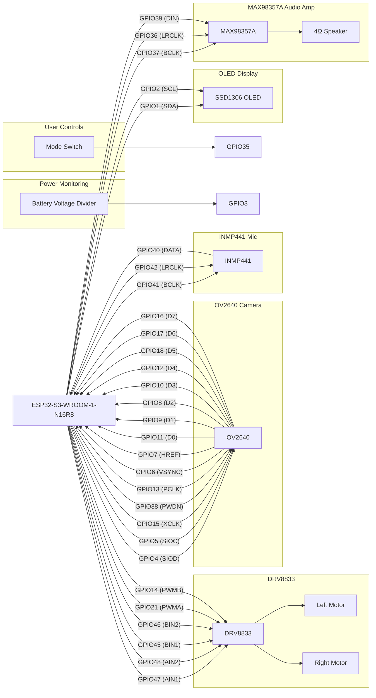

---

## I/O Pin Assignment if needed:

| GPIO   | Function    | Connected Device |
| ------ | ----------- | ---------------- |
| GPIO1  | I2C SDA     | SSD1306 OLED     |
| GPIO2  | I2C SCL     | SSD1306 OLED     |
| GPIO3  | ADC         | Battery Monitor  |
| GPIO4  | SCCB SDA    | OV2640           |
| GPIO5  | SCCB SCL    | OV2640           |
| GPIO6  | VSYNC       | OV2640           |
| GPIO7  | HREF        | OV2640           |
| GPIO8  | Camera D2   | OV2640           |
| GPIO9  | Camera D1   | OV2640           |
| GPIO10 | Camera D3   | OV2640           |
| GPIO11 | Camera D0   | OV2640           |
| GPIO12 | Camera D4   | OV2640           |
| GPIO13 | PCLK        | OV2640           |
| GPIO14 | Motor PWM B | DRV8833          |
| GPIO15 | XCLK        | OV2640           |
| GPIO16 | Camera D7   | OV2640           |
| GPIO17 | Camera D6   | OV2640           |
| GPIO18 | Camera D5   | OV2640           |
| GPIO21 | Motor PWM A | DRV8833          |
| GPIO35 | Mode Switch | User Input       |
| GPIO36 | I2S LRCLK   | MAX98357A        |
| GPIO37 | I2S BCLK    | MAX98357A        |
| GPIO38 | Camera PWDN | OV2640           |
| GPIO39 | I2S DIN     | MAX98357A        |
| GPIO40 | I2S DATA    | INMP441          |
| GPIO41 | I2S BCLK    | INMP441          |
| GPIO42 | I2S LRCLK   | INMP441          |
| GPIO45 | Motor BIN1  | DRV8833          |
| GPIO46 | Motor BIN2  | DRV8833          |
| GPIO47 | Motor AIN1  | DRV8833          |
| GPIO48 | Motor AIN2  | DRV8833          |


---

## PCB Design Requirements

1. All modules must share common ground.

2. Camera connector must be placed close to ESP32.

3. Motor power traces must be wider than signal traces.

4. Place bulk capacitor near motor driver.

5. Keep microphone traces away from motor traces.

6. Keep antenna area free of copper pours.

7. Provide JST battery connector.

8. Provide programming header.

9. Provide battery voltage monitoring circuit.

10. Provide power status LED.

---

## System Architecture

The robot acts as a network-connected hardware endpoint.

All educational content, speech analysis, tracking algorithms, lesson management, and user management are executed on the backend server.

The ESP32-S3 primarily performs:

* Audio playback
* Audio recording
* Image capture
* Motor control
* Display control
* Communication with backend services

---

## Audio streaming and learning sessions
When the robot is turned on and connects to wifi, it sends an HTTP request to the server to start the learning session. The server responds with a "OK" status, sample response:
```bash
HTTP/1.1 200 OK
Content-Type: application/json
{
    "status": "ok",
    "message": ""
}
```
Then sever sends greetings audio to the robot. Robot plays the audio and waits for the kid to respond. When the learning session starts, server sends an audio containing questions for the kid to answer. Sample incoming question audio:
```bash
HTTP/1.1 200 OK
Content-Type: application/json
{
    "status": "question",
    "message": "
        "audio": "sample.wav",
        "waiting_period": "15"
    "
}
```
Robot plays the audio and waits necessary time (waiting_period) for the kid to respond. After playing the audio, robot activates microphone and collects audio data from the kid. The collected audio is sent back to the server. server responds with "OK" to the robot's request after the audio is sent back.
Sample response \#1:
```bash
HTTP/1.1 200 OK
Content-Type: application/json
{
    "status": "next_question",
    "message": "
        "audio1": "congratulations.wav",
        "audio2": "next_question.wav",
        "waiting_period": "15"
    "
}
```
Sample response \#2:
```bash
HTTP/1.1 200 OK
Content-Type: application/json
{
    "status": "question_repeat",
    "message": "
        "audio1": "saying_wrong_answer.wav",
        "audio2": "question.wav",
        "waiting_period": "15"
    "
}
```
Sample response \#3:
```bash
HTTP/1.1 200 OK
Content-Type: application/json
{
    "status": "next_question_with_previous_answer",
    "message": "
        "audio1": "right_answer.wav",
        "audio2": "next_question.wav",
        "waiting_period": "15"
    "
}
```
### Video feed processing for robot's movement with kids
Video feed is streamed to the server for real-time monitoring. When the robot is turned on, camera feed is enabled and streams video to the server using wifi. Server always responds to the robot's requests as "OK" unless the kid away from the center. Sample response is:
```bash
HTTP/1.1 200 OK
Content-Type: application/json
{
    "status": "ok",
    "message": ""
}
```
When the kid is away, sample server response is:
```bash
HTTP/1.1 200 OK
Content-Type: application/json{
    "status": "move",
    "message": "
        "right":"0.1cm",
        "left":"0.1cm",
        "forward":"0.1cm",
        "backward":"0.0cm",
    "
}
```
Inside robot, esp32-N16R8 is connected to the robot wheel motors, upon receiving a command from the server, it moves the robot accordingly by calculating the distance, motor speed and direction to move.

---

## Server design
### Audio processing techniques
An util function `audio_processing` is used to process the audio files and generate the audio responses for the robot. The server compares featured vector of incoming .wav file with the featured vectors of probable answers and scores the percentage similarity. If the similarity score is above a threshold, the server responds with the corresponding audio file. For generating featured vectors of audio files, we used MFCC+DTW algorithom.
Visual representation of audio processing:
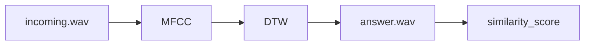
# Data Models Documentation

---

## Architecture verview

The system is organized into three primary domains:

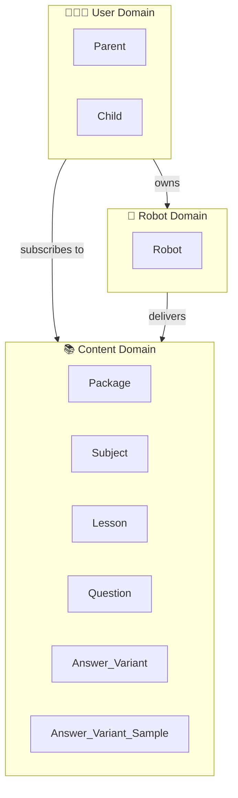

---

## Enumerations

All enums derive `Debug`, `Clone`, `Copy`, `PartialEq`, `Eq`, `Serialize`, `Deserialize`, and `sqlx::Type`. They are mapped to PostgreSQL custom types via `#[sqlx(type_name = "...", rename_all = "snake_case")]`.

### ParentRole

Maps to PostgreSQL type: `parent_role`

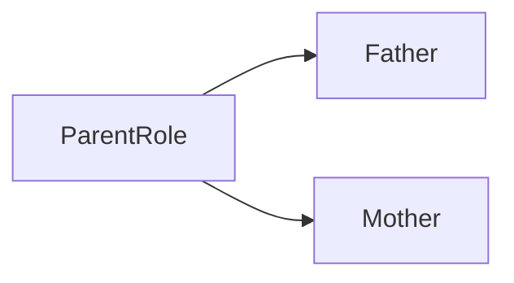

| Variant  | DB Value   | Description              |
|----------|------------|--------------------------|
| `Father` | `father`   | The parent is the father |
| `Mother` | `mother`   | The parent is the mother |

---

### ChildGender

Maps to PostgreSQL type: `child_gender`

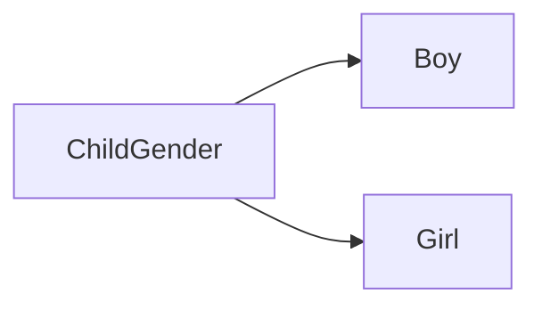

| Variant | DB Value | Description       |
|---------|----------|-------------------|
| `Boy`   | `boy`    | Child is male     |
| `Girl`  | `girl`   | Child is female   |

---

### RobotStatus

Maps to PostgreSQL type: `robot_status`

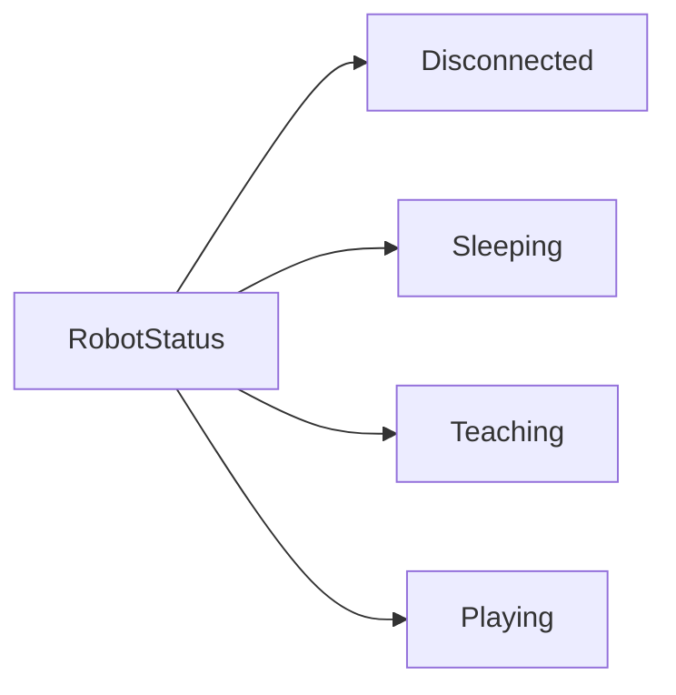

| Variant        | DB Value       | Description                              |
|----------------|----------------|------------------------------------------|
| `Disconnected` | `disconnected` | Robot has no active connection           |
| `Sleeping`     | `sleeping`     | Robot is idle / in low-power mode        |
| `Teaching`     | `teaching`     | Robot is actively delivering a lesson    |
| `Playing`      | `playing`      | Robot is in free-play mode with a child  |

---

### SessionStatus

Maps to PostgreSQL type: `session_status`

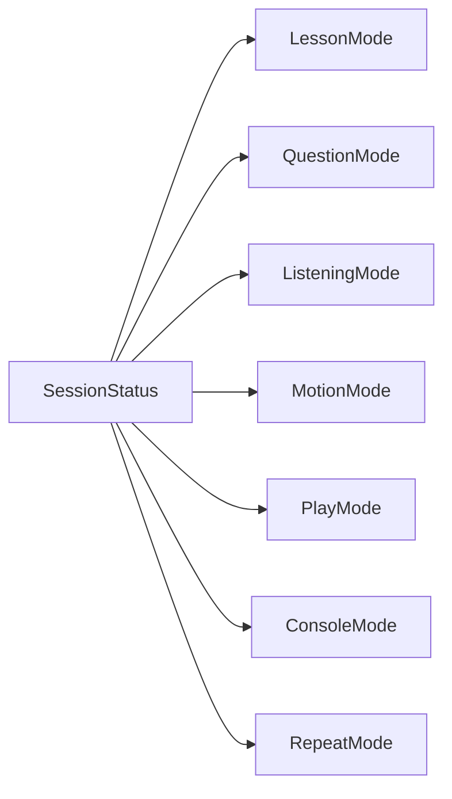

| Variant         | DB Value         | Description                                  |
|-----------------|------------------|----------------------------------------------|
| `LessonMode`    | `lesson_mode`    | Delivering lesson content                    |
| `QuestionMode`  | `question_mode`  | Asking or awaiting a question response       |
| `ListeningMode` | `listening_mode` | Actively listening to the child's response   |
| `MotionMode`    | `motion_mode`    | Performing physical/motion actions           |
| `PlayMode`      | `play_mode`      | Unstructured play interaction                |
| `ConsoleMode`   | `console_mode`   | Administrative / developer control mode      |
| `RepeatMode`    | `repeat_mode`    | Repeating previously delivered content       |

---

### LessonStatus

Maps to PostgreSQL type: `lesson_status`

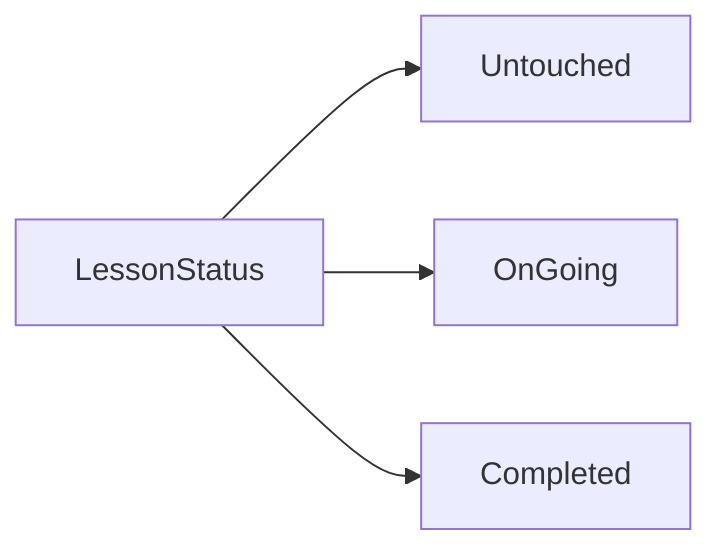

| Variant     | DB Value    | Description                              |
|-------------|-------------|------------------------------------------|
| `Untouched` | `untouched` | Lesson has not been started              |
| `OnGoing`   | `on_going`  | Lesson is currently in progress          |
| `Completed` | `completed` | Lesson has been finished by the child    |

---

## Content Domain

### Package

A top-level grouping of educational content (e.g., a curriculum bundle).

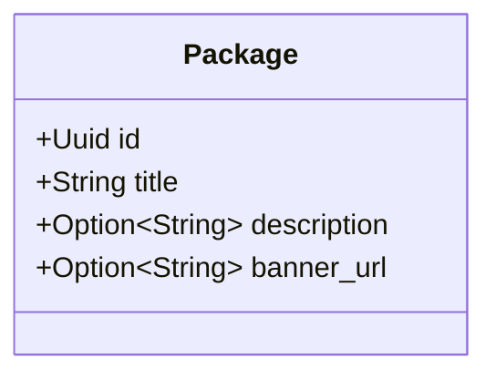

| Field         | Type              | Nullable | Description                         |
|---------------|-------------------|----------|-------------------------------------|
| `id`          | `Uuid`            | No       | Primary key                         |
| `title`       | `String`          | No       | Display name of the package         |
| `description` | `Option<String>`  | Yes      | Optional human-readable description |
| `banner_url`  | `Option<String>`  | Yes      | Optional URL to a banner image      |

---

### Subject

A subject or topic area (e.g., Mathematics, Language).

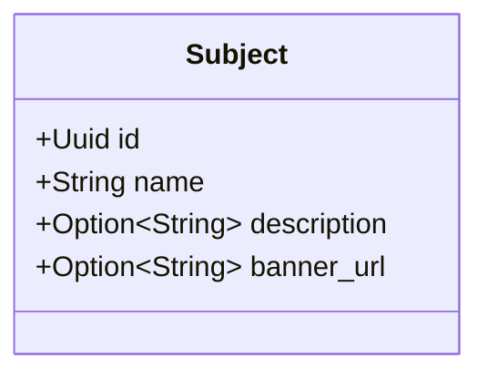

| Field         | Type             | Nullable | Description                     |
|---------------|------------------|----------|---------------------------------|
| `id`          | `Uuid`           | No       | Primary key                     |
| `name`        | `String`         | No       | Name of the subject             |
| `description` | `Option<String>` | Yes      | Optional description            |
| `banner_url`  | `Option<String>` | Yes      | Optional URL to a banner image  |

---

### Lesson

A single lesson unit, belonging to a Package and a Subject.

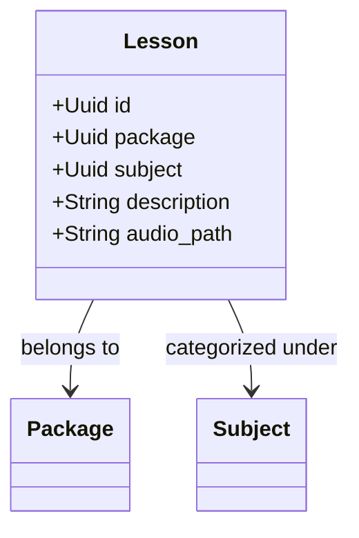

| Field         | Type     | Nullable | Description                           |
|---------------|----------|----------|---------------------------------------|
| `id`          | `Uuid`   | No       | Primary key                           |
| `package`     | `Uuid`   | No       | FK → `Package.id`                     |
| `subject`     | `Uuid`   | No       | FK → `Subject.id`                     |
| `description` | `String` | No       | Textual description of the lesson     |
| `audio_path`  | `String` | No       | File path to the lesson audio content |

---

### Question

A question attached to a lesson, delivered by the robot after lesson content.

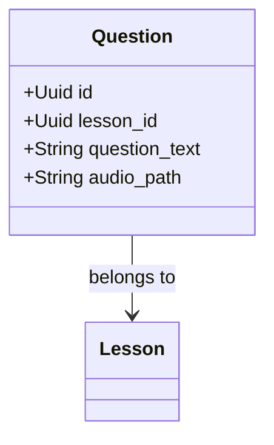

| Field           | Type     | Nullable | Description                         |
|-----------------|----------|----------|-------------------------------------|
| `id`            | `Uuid`   | No       | Primary key                         |
| `lesson_id`     | `Uuid`   | No       | FK → `Lesson.id`                    |
| `question_text` | `String` | No       | The text of the question            |
| `audio_path`    | `String` | No       | File path to the question audio     |

---

### Answer_Variant

A possible correct answer variant for a question.

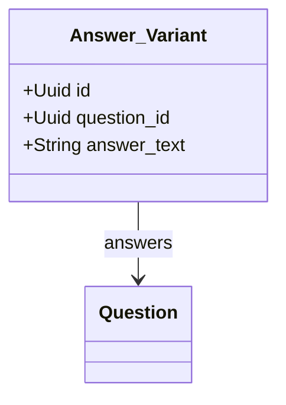

| Field         | Type     | Nullable | Description                        |
|---------------|----------|----------|------------------------------------|
| `id`          | `Uuid`   | No       | Primary key                        |
| `question_id` | `Uuid`   | No       | FK → `Question.id`                 |
| `answer_text` | `String` | No       | The text of this answer variant    |

> **Note:** Naming convention uses `Answer_Variant` (with underscore). Consider renaming to `AnswerVariant` to follow Rust's `UpperCamelCase` convention.

---

### Answer_Variant_Sample

Audio and feature vector samples for a given answer variant, used for voice recognition/matching.

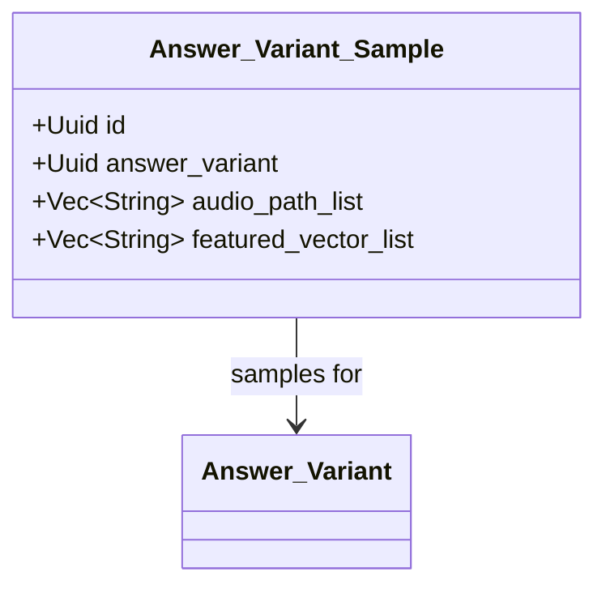

| Field                  | Type          | Nullable | Description                                     |
|------------------------|---------------|----------|-------------------------------------------------|
| `id`                   | `Uuid`        | No       | Primary key                                     |
| `answer_variant`       | `Uuid`        | No       | FK → `Answer_Variant.id`                        |
| `audio_path_list`      | `Vec<String>` | No       | List of audio file paths for this answer        |
| `featured_vector_list` | `Vec<String>` | No       | List of feature vectors (for voice recognition) |

---

## User Domain

### Parent

A registered parent/guardian who owns a robot and has a child account under them.

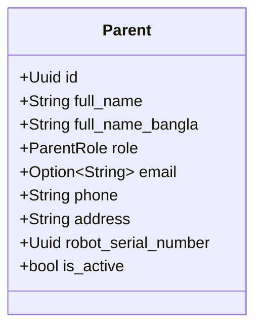

| Field                 | Type             | Nullable | Description                              |
|-----------------------|------------------|----------|------------------------------------------|
| `id`                  | `Uuid`           | No       | Primary key                              |
| `full_name`           | `String`         | No       | Full name in English                     |
| `full_name_bangla`    | `String`         | No       | Full name in Bangla                      |
| `role`                | `ParentRole`     | No       | `Father` or `Mother`                     |
| `email`               | `Option<String>` | Yes      | Optional email address                   |
| `phone`               | `String`         | No       | Phone number                             |
| `address`             | `String`         | No       | Physical address                         |
| `robot_serial_number` | `Uuid`           | No       | FK → `Robot.serial_number`               |
| `is_active`           | `bool`           | No       | Whether the account is currently active  |

---

### Child

A child profile associated with a parent, with demographic and educational metadata.

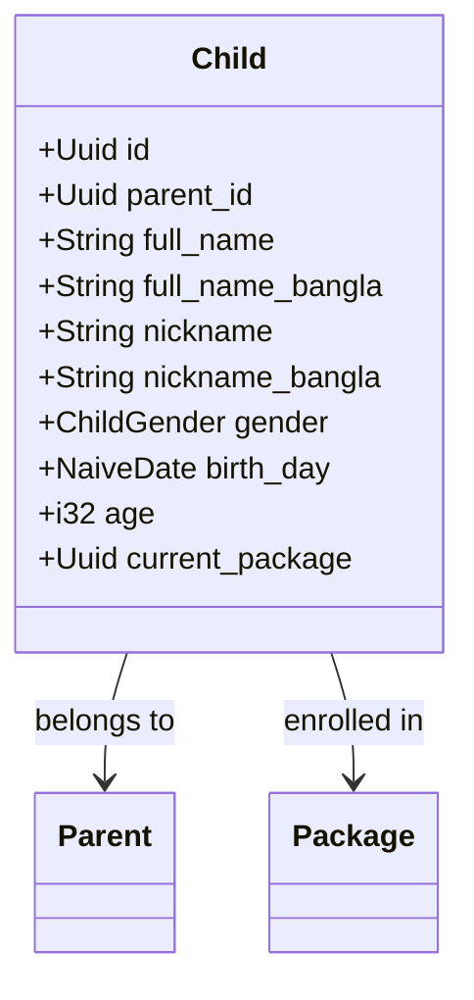

| Field               | Type          | Nullable | Description                         |
|---------------------|---------------|----------|-------------------------------------|
| `id`                | `Uuid`        | No       | Primary key                         |
| `parent_id`         | `Uuid`        | No       | FK → `Parent.id`                    |
| `full_name`         | `String`      | No       | Full name in English                |
| `full_name_bangla`  | `String`      | No       | Full name in Bangla                 |
| `nickname`          | `String`      | No       | Nickname in English                 |
| `nickname_bangla`   | `String`      | No       | Nickname in Bangla                  |
| `gender`            | `ChildGender` | No       | `Boy` or `Girl`                     |
| `birth_day`         | `NaiveDate`   | No       | Date of birth                       |
| `age`               | `i32`         | No       | Current age (in years)              |
| `current_package`   | `Uuid`        | No       | FK → `Package.id` (active content)  |

---

## Robot Domain

### Robot

A physical robot device assigned to a family, capable of delivering lessons and interacting with children.

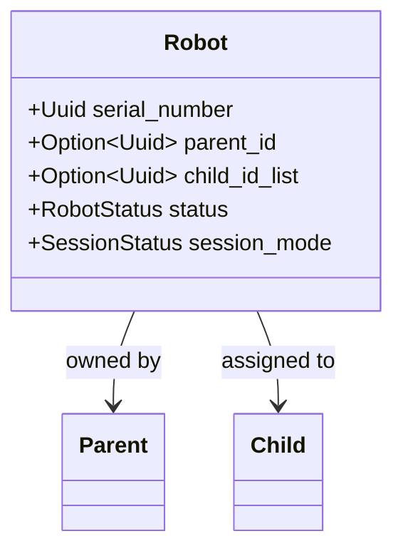

| Field          | Type              | Nullable | Description                                   |
|----------------|-------------------|----------|-----------------------------------------------|
| `serial_number`| `Uuid`            | No       | Primary key (device serial)                   |
| `parent_id`    | `Option<Uuid>`    | Yes      | FK → `Parent.id` (optional owner)             |
| `child_id_list`| `Option<Uuid>`    | Yes      | FK → `Child.id` (currently a single UUID*)   |
| `status`       | `RobotStatus`     | No       | Current operational status of the robot       |
| `session_mode` | `SessionStatus`   | No       | Current session mode of the robot             |

> **⚠️ Note:** `child_id_list` is typed as `Option<Uuid>` but named as a "list". Consider using `Vec<Uuid>` or `Option<Vec<Uuid>>` if multiple children per robot is intended.

---

## Entity Relationship Diagram

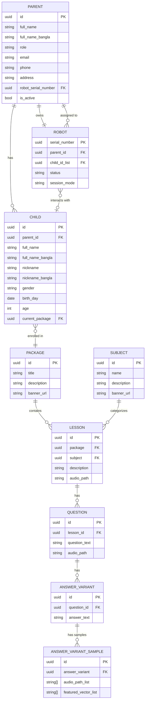

---

## State Diagrams

### Robot Lifecycle

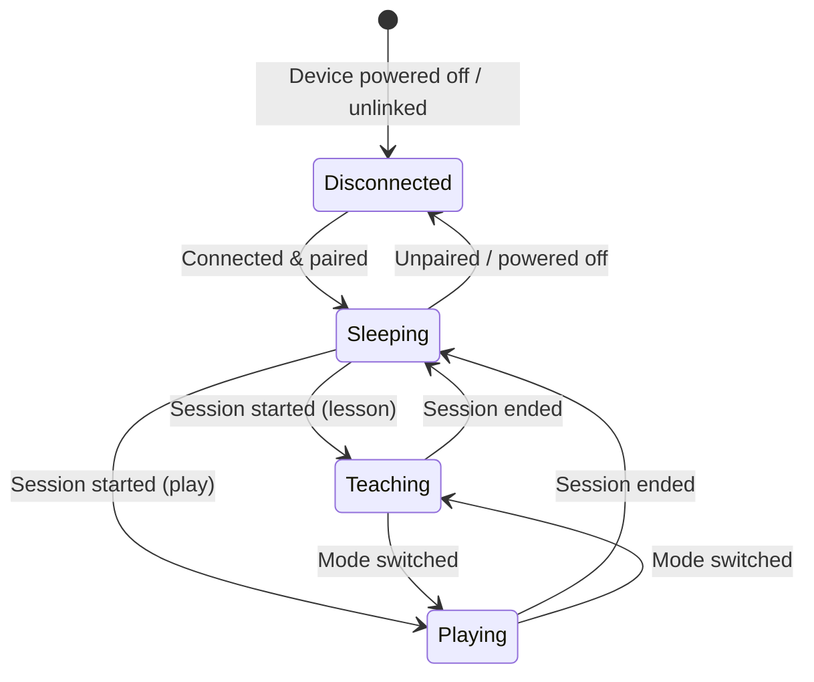

---

### Lesson Progress

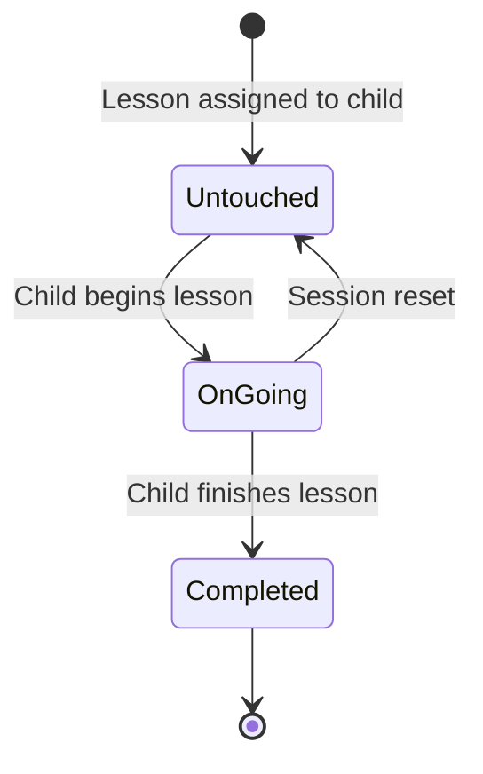

---

### Robot Session Flow

```mermaid
stateDiagram-v2
    [*] --> LessonMode : Lesson begins

    LessonMode --> QuestionMode : Lesson content ends
    QuestionMode --> ListeningMode : Question delivered
    ListeningMode --> QuestionMode : No valid response (retry)
    ListeningMode --> LessonMode : Answer accepted

    LessonMode --> RepeatMode : Repeat requested
    RepeatMode --> LessonMode : Replay complete

    LessonMode --> MotionMode : Motion cue triggered
    MotionMode --> LessonMode : Motion complete

    LessonMode --> PlayMode : Play mode activated
    PlayMode --> LessonMode : Return to lesson

    LessonMode --> ConsoleMode : Admin override
    ConsoleMode --> LessonMode : Console closed
```

---

## Dependencies

| Crate       | Usage                                      |
|-------------|--------------------------------------------|
| `chrono`    | `DateTime<Utc>`, `NaiveDate` — date/time types |
| `serde`     | `Serialize`, `Deserialize` — JSON (de)serialization |
| `sqlx`      | `FromRow`, `sqlx::Type` — PostgreSQL ORM mapping |
| `uuid`      | `Uuid` — universally unique identifiers     |

---

*Documentation generated from `src/models.rs` — last updated June 2026.*